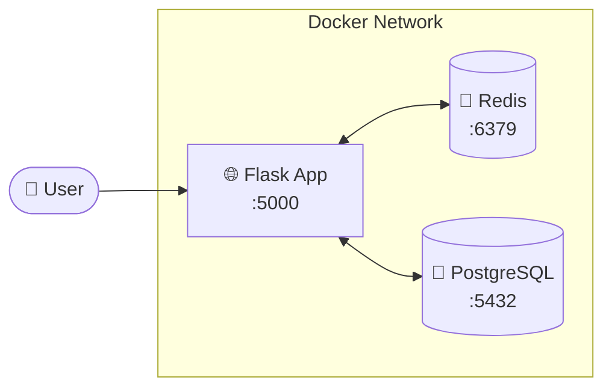
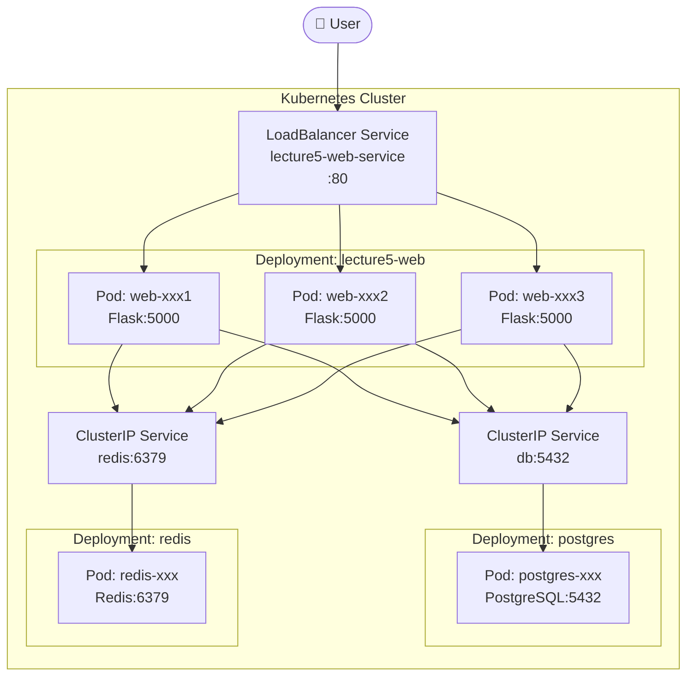
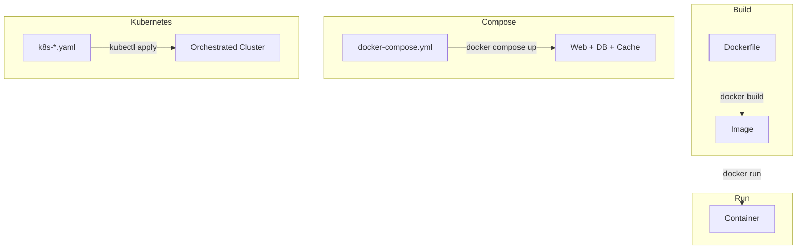

# Link to forked repository: https://github.com/domi-cmd/lecture5-dockerk8s-demo

# Docker Hub Username: domicmd

# Task 1
## (a) Adminer
### Files changed:
Only the the requested docker-compose.yml


## (b) Change the base image
a) What changes are needed to make it work with Alpine?  
Change this line number 12 in Dockerfile from "slim" to "alpine":
```cmd
FROM python:3.11-slim
```
b) Build both versions and compare sizes using docker images: (It's interesting that the alpine image is smaller than the slime one??)
```cmd
Domi\Homework_1\lecture5-dockerk8s-demo>docker images
REPOSITORY                    TAG         IMAGE ID       CREATED       SIZE
lecture5-webapp               alpine      c9686577c56d   2 days ago    127MB
lecture5-webapp               slim        5f92a97e171d   2 days ago    232MB
lecture5-dockerk8s-demo-web   latest      ba9734a8ce13   2 days ago    232MB
adminer                       latest      16a72c6140f6   9 days ago    170MB
postgres                      15-alpine   fceb6f86328c   3 weeks ago   392MB
redis                         7-alpine    8b81dd37ff02   3 weeks ago   60.7MB
```
c) Document the size difference and any build issues you encountered
The alpine image version is 45% smaller than the slim image. I would have expected it to be the other way around. I didn't encounter any build issues, but ran into some accessing/deploymned(?) issues because of allocating the same localhost port for the different images.

# Task 2
## (a) Image Tagging and Registry
### Commands used:
```cmd
Domi\Homework_1\lecture5-dockerk8s-demo>docker login
Authenticating with existing credentials... [Username: domicmd]

i Info → To login with a different account, run 'docker logout' followed by 'docker login'

Login Succeeded

Domi\Homework_1\lecture5-dockerk8s-demo>docker build -t domicmd/task-app:v1.0 .
[+] Building 0.7s (12/12) FINISHED                                                                                                                     docker:desktop-linux
 => [internal] load build definition from Dockerfile                                                                                                                   0.0s
 => => transferring dockerfile: 1.80kB                                                                                                                                 0.0s
 => [internal] load metadata for docker.io/library/python:3.11-alpine                                                                                                  0.2s
 => [internal] load .dockerignore                                                                                                                                      0.0s
 => => transferring context: 236B                                                                                                                                      0.0s
 => [1/7] FROM docker.io/library/python:3.11-alpine@sha256:f07e2ace46f560f09a6eeec7b4913b80ee99546e749ef82342a419a326620856                                            0.0s
 => => resolve docker.io/library/python:3.11-alpine@sha256:f07e2ace46f560f09a6eeec7b4913b80ee99546e749ef82342a419a326620856                                            0.0s
 => [internal] load build context                                                                                                                                      0.0s
 => => transferring context: 275B                                                                                                                                      0.0s
 => CACHED [2/7] WORKDIR /app                                                                                                                                          0.0s
 => CACHED [3/7] COPY requirements.txt .                                                                                                                               0.0s
 => CACHED [4/7] RUN pip install --no-cache-dir -r requirements.txt                                                                                                    0.0s
 => CACHED [5/7] COPY app.py .                                                                                                                                         0.0s
 => CACHED [6/7] COPY templates/ templates/                                                                                                                            0.0s
 => CACHED [7/7] COPY assets/ assets/                                                                                                                                  0.0s
 => exporting to image                                                                                                                                                 0.1s
 => => exporting layers                                                                                                                                                0.0s
 => => exporting manifest sha256:5a722d4667173ef25831ace80b67fa6a541378f9646170879af4deba3bed0b75                                                                      0.0s
 => => exporting config sha256:49c90c3692f9981655364d1cbb84c140a837ea2253a35d1f9a04081639e23fac                                                                        0.0s
 => => exporting attestation manifest sha256:2757c1ac848284723d52a65f91482cf0f347b8fedd186566209ca1d486e6b3de                                                          0.0s
 => => exporting manifest list sha256:5823173245306100bd7e85835f492bc41a9846b6be76d25547f558aae2d52d84                                                                 0.0s
 => => naming to docker.io/domicmd/task-app:v1.0                                                                                                                       0.0s
 => => unpacking to docker.io/domicmd/task-app:v1.0                                                                                                                    0.0s

View build details: docker-desktop://dashboard/build/desktop-linux/desktop-linux/s99vuq4tbdwngtq6lzl2ct0hb

Domi\Homework_1\lecture5-dockerk8s-demo>docker push domicmd/task-app:v1.0
The push refers to repository [docker.io/domicmd/task-app]
97e526324ae9: Pushed
589002ba0eae: Mounted from domicmd/lecture5-webapp
42d947d76d9e: Mounted from domicmd/lecture5-webapp
b07ed0e2b2fd: Mounted from domicmd/lecture5-webapp
92964b859cb8: Mounted from domicmd/lecture5-webapp
811797f98545: Mounted from domicmd/lecture5-webapp
cbaa01634a9f: Mounted from domicmd/lecture5-webapp
0b03716e5e03: Mounted from domicmd/lecture5-webapp
d578531a3710: Mounted from domicmd/lecture5-webapp
8d1e490ed26d: Mounted from domicmd/lecture5-webapp
eb00511b4ef6: Mounted from domicmd/lecture5-webapp
v1.0: digest: sha256:5823173245306100bd7e85835f492bc41a9846b6be76d25547f558aae2d52d84 size: 856
```
### Docker Hub Image Screenshot:


## (b) Container Inspection
### docker compose logs web:
-> Calls docker compose and prints all the logs from the web app container to the terminal.

### docker inspect lecture5-web
-> Tells docker to create and print a json dump file of the entire lecture5-web docker container, which includes things such as the ID of the images, mounts, etc.

### docker stats
-> Displays stats for all running docker containers in the terminal, including the container id, name, CPU and memory usage, and other things (PIDS probably pod ID's?)

# Task 3
## (a) Deploy the Application (Screenshots + pods as requested)
## Issues encountered: 
Only worked when I fixed the command to have two instead of one "-": kubectl scale deployment lecture5-web -–replicas=5

```cmd
Domi\Homework_1\lecture5-dockerk8s-demo>kubectl get pods
NAME                            READY   STATUS    RESTARTS   AGE
lecture5-web-7594658b4f-jwkll   1/1     Running   0          77s
lecture5-web-7594658b4f-lg84k   1/1     Running   0          74s
lecture5-web-7594658b4f-xdgxx   1/1     Running   0          80s
postgres-5b558847bf-q65w6       1/1     Running   0          6m45s
redis-586cf667d9-tvgdh          1/1     Running   0          6m45s
```


## (b) Scale and Test Load Balancing 

### Issues encountered: 
The file would only run when I changed the line <SERVICE_URL = "http://127.0.0.1:63501/info"> to <SERVICE_URL = "http://localhost/info> in the code.

**Balancing Test Output:**
```cmd
Domi\Homework_1\lecture5-dockerk8s-demo>python test_load_balancing.py
🚀 Testing load balancing across pods...
📍 Service URL: http://localhost/info
🔄 Making 20 requests...

Request  1: Served by lecture5-web-7594658b4f-jwkll
Request  2: Served by lecture5-web-7594658b4f-jwkll
Request  3: Served by lecture5-web-7594658b4f-hvmxl
Request  4: Served by lecture5-web-7594658b4f-jwkll
Request  5: Served by lecture5-web-7594658b4f-jwkll
Request  6: Served by lecture5-web-7594658b4f-49wmg
Request  7: Served by lecture5-web-7594658b4f-hvmxl
Request  8: Served by lecture5-web-7594658b4f-jwkll
Request  9: Served by lecture5-web-7594658b4f-49wmg
Request 10: Served by lecture5-web-7594658b4f-hvmxl
Request 11: Served by lecture5-web-7594658b4f-49wmg
Request 12: Served by lecture5-web-7594658b4f-hvmxl
Request 13: Served by lecture5-web-7594658b4f-lg84k
Request 14: Served by lecture5-web-7594658b4f-jwkll
Request 15: Served by lecture5-web-7594658b4f-xdgxx
Request 16: Served by lecture5-web-7594658b4f-lg84k
Request 17: Served by lecture5-web-7594658b4f-49wmg
Request 18: Served by lecture5-web-7594658b4f-49wmg
Request 19: Served by lecture5-web-7594658b4f-hvmxl
Request 20: Served by lecture5-web-7594658b4f-lg84k

============================================================
📊 LOAD BALANCING RESULTS
============================================================

Total successful requests: 20
Number of unique pods serving requests: 5

lecture5-web-7594658b4f-jwkll:  6 requests ( 30.0%) ██████
lecture5-web-7594658b4f-hvmxl:  5 requests ( 25.0%) █████
lecture5-web-7594658b4f-49wmg:  5 requests ( 25.0%) █████
lecture5-web-7594658b4f-lg84k:  3 requests ( 15.0%) ███
lecture5-web-7594658b4f-xdgxx:  1 requests (  5.0%) █

============================================================
✅ SUCCESS: Load balancing is working!
   Traffic distributed across 5 pods
============================================================
```

** Explain: How does Kubernetes distribute traffic? (2-3 sentences)**:
Whenever we sent a request to the webapp running on localhost, kubernetes automatically takes that request and gives it to a randomly chosen available pod. It attempts to spread the traffic evenly, using round robin logic for picking what running pod to choose. Whenever pods are added, removed or become unhealthy/crash, kubernetes automatically takes this into account when distributing traffic.

## (c) Self-Healing
**Explain: Why is self-healing important? (2-3 sentences):**
Self-healing means that whenever a pod crashes or gets deleted, kubernetes automatically starts up/creates a replacement pod. This way, the configured number of replica pods is guaranteed to be maintained by the system, even if something crashes overnight. This avoids overloading of the system, as it avoids downtime due to some system part failing.
```cmd
Domi\Homework_1\lecture5-dockerk8s-demo>kubectl get pods
NAME                            READY   STATUS    RESTARTS   AGE
lecture5-web-7594658b4f-49wmg   1/1     Running   0          14m
lecture5-web-7594658b4f-hvmxl   1/1     Running   0          14m
lecture5-web-7594658b4f-jwkll   1/1     Running   0          19m
lecture5-web-7594658b4f-lg84k   1/1     Running   0          19m
lecture5-web-7594658b4f-xdgxx   1/1     Running   0          20m
postgres-5b558847bf-q65w6       1/1     Running   0          25m
redis-586cf667d9-tvgdh          1/1     Running   0          25m

Domi\Homework_1\lecture5-dockerk8s-demo>kubectl delete pod lecture5-web-7594658b4f-49wmg
pod "lecture5-web-7594658b4f-49wmg" deleted

Domi\Homework_1\lecture5-dockerk8s-demo>kubectl get pods
NAME                            READY   STATUS    RESTARTS   AGE
lecture5-web-7594658b4f-hvmxl   1/1     Running   0          15m
lecture5-web-7594658b4f-jwkll   1/1     Running   0          20m
lecture5-web-7594658b4f-lg84k   1/1     Running   0          20m
lecture5-web-7594658b4f-v2psp   1/1     Running   0          5s
lecture5-web-7594658b4f-xdgxx   1/1     Running   0          20m
postgres-5b558847bf-q65w6       1/1     Running   0          26m
redis-586cf667d9-tvgdh          1/1     Running   0          26m

Domi\Homework_1\lecture5-dockerk8s-demo>kubectl get pods
NAME                            READY   STATUS    RESTARTS   AGE
lecture5-web-7594658b4f-hvmxl   1/1     Running   0          15m
lecture5-web-7594658b4f-jwkll   1/1     Running   0          20m
lecture5-web-7594658b4f-lg84k   1/1     Running   0          20m
lecture5-web-7594658b4f-v2psp   1/1     Running   0          21s
lecture5-web-7594658b4f-xdgxx   1/1     Running   0          20m
postgres-5b558847bf-q65w6       1/1     Running   0          26m
redis-586cf667d9-tvgdh          1/1     Running   0          26m

Domi\Homework_1\lecture5-dockerk8s-demo>kubectl delete pod lecture5-web-7594658b4f-hvmxl
pod "lecture5-web-7594658b4f-hvmxl" deleted

Domi\Homework_1\lecture5-dockerk8s-demo>kubectl get pods
NAME                            READY   STATUS    RESTARTS   AGE
lecture5-web-7594658b4f-5d9p4   1/1     Running   0          3s
lecture5-web-7594658b4f-jwkll   1/1     Running   0          21m
lecture5-web-7594658b4f-lg84k   1/1     Running   0          21m
lecture5-web-7594658b4f-v2psp   1/1     Running   0          37s
lecture5-web-7594658b4f-xdgxx   1/1     Running   0          21m
postgres-5b558847bf-q65w6       1/1     Running   0          26m
redis-586cf667d9-tvgdh          1/1     Running   0          26m
```


# Lecture 5: Docker & Kubernetes Demo

> DevOps for Cyber-Physical Systems | University of Bern

A Task Manager app demonstrating Docker containerization and Kubernetes orchestration.

## Architecture

**Docker Compose:**


**Kubernetes:**


## Project Structure

```
lecture5-docker-demo/
├── app.py              # Flask application
├── Dockerfile          # Build instructions
├── docker-compose.yml  # Multi-service setup
├── k8s-backend.yaml    # K8s: PostgreSQL + Redis
├── k8s-web.yaml        # K8s: Web app deployment
├── test_load_balancing.py  # Load balancing test
├── templates/
│   └── index.html      # Web UI
└── assets/             # Logo images
```

---

# Part 1: Docker 🐳

## Quick Start with Docker Compose

```bash
# Start all services
docker compose up

# Open http://localhost:5000

# Stop
docker compose down
```

## Docker Commands Reference

| Command | Description |
|---------|-------------|
| `docker compose up` | Start all services |
| `docker compose down` | Stop all services |
| `docker compose down -v` | Stop + delete data |
| `docker compose logs -f` | View logs |
| `docker compose exec db psql -U taskuser -d taskdb` | Access database |
| `docker compose exec redis redis-cli` | Access Redis |

## Building Your Own Docker Image

**Option 1: Build yourself**
```bash
docker build -t YOUR-USERNAME/lecture5-webapp:v1.0 .
docker push YOUR-USERNAME/lecture5-webapp:v1.0
```

**Option 2: Use pre-built image**
```bash
# Use merabro/lecture5-webapp:v1.1 in your deployments
# Already built and available on Docker Hub
```

---

# Part 2: Kubernetes ☸️

## Prerequisites

Install Minikube for local Kubernetes:
- **Windows/Mac**: Enable Kubernetes in Docker Desktop Settings
- **All platforms**: Install Minikube from https://minikube.sigs.k8s.io/

## Step 1: Start Minikube

```bash
minikube start
```

<details>
<summary>Expected Output</summary>

```
😄  minikube v1.37.0 on Microsoft Windows 11
✨  Automatically selected the docker driver
👍  Starting "minikube" primary control-plane node in "minikube" cluster
🔥  Creating docker container (CPUs=2, Memory=7900MB) ...
🐳  Preparing Kubernetes v1.34.0 on Docker 28.4.0 ...
🔗  Configuring bridge CNI (Container Networking Interface) ...
🔎  Verifying Kubernetes components...
🌟  Enabled addons: storage-provisioner, default-storageclass
🏄  Done! kubectl is now configured to use "minikube" cluster
```
</details>

## Step 2: Build and Push Docker Image

```bash
# Build the image
docker build -t merabro/lecture5-webapp:v1.1 .

# Login to Docker Hub
docker login

# Push to Docker Hub
docker push merabro/lecture5-webapp:v1.1
```

<details>
<summary>Expected Output</summary>

```
[+] Building 9.2s (13/13) FINISHED
 => [1/7] FROM docker.io/library/python:3.11-slim
 => [2/7] WORKDIR /app
 => [3/7] COPY requirements.txt .
 => [4/7] RUN pip install --no-cache-dir -r requirements.txt
 => [5/7] COPY app.py .
 => [6/7] COPY templates/ templates/
 => [7/7] COPY assets/ assets/
 => exporting to image

The push refers to repository [docker.io/merabro/lecture5-webapp]
v1.1: digest: sha256:a827246ae97bcc39ab8930e90935690d71aec1bb54a46d92751b478fdd647481
```
</details>

## Step 3: Deploy Backend Services (PostgreSQL + Redis)

```bash
kubectl apply -f k8s-backend.yaml
```

<details>
<summary>Expected Output</summary>

```
persistentvolumeclaim/postgres-pvc created
deployment.apps/postgres created
service/db created
deployment.apps/redis created
service/redis created
```
</details>

Check backend pods:
```bash
kubectl get pods
```

<details>
<summary>Expected Output</summary>

```
NAME                        READY   STATUS    RESTARTS   AGE
postgres-5695fbfd64-mlcqw   1/1     Running   0          14s
redis-57566c54f6-nzbtj      1/1     Running   0          14s
```
</details>

## Step 4: Deploy Web Application

```bash
kubectl apply -f k8s-web.yaml
```

<details>
<summary>Expected Output</summary>

```
deployment.apps/lecture5-web created
service/lecture5-web-service created
```
</details>

Check all resources:
```bash
kubectl get deployments
kubectl get services
kubectl get pods
```

<details>
<summary>Expected Output</summary>

```
NAME           READY   UP-TO-DATE   AVAILABLE   AGE
lecture5-web   3/3     3            3           67s
postgres       1/1     1            1           101s
redis          1/1     1            1           101s

NAME                   TYPE           CLUSTER-IP       PORT(S)        AGE
db                     ClusterIP      10.99.17.144     5432/TCP       104s
kubernetes             ClusterIP      10.96.0.1        443/TCP        5m5s
lecture5-web-service   LoadBalancer   10.107.153.104   80:30262/TCP   70s
redis                  ClusterIP      10.99.151.191    6379/TCP       104s

NAME                           READY   STATUS    RESTARTS   AGE
lecture5-web-5c5d44c79-7zb57   1/1     Running   0          75s
lecture5-web-5c5d44c79-n4zx5   1/1     Running   0          75s
lecture5-web-5c5d44c79-qqqdx   1/1     Running   0          75s
postgres-5695fbfd64-mlcqw      1/1     Running   0          109s
redis-57566c54f6-nzbtj         1/1     Running   0          109s
```
</details>

## Step 5: Access the Application

```bash
minikube service lecture5-web-service
```

<details>
<summary>Expected Output</summary>

```
┌───────────┬──────────────────────┬─────────────┬────────────────────────┐
│ NAMESPACE │         NAME         │ TARGET PORT │          URL           │
├───────────┼──────────────────────┼─────────────┼────────────────────────┤
│ default   │ lecture5-web-service │             │ http://127.0.0.1:63501 │
└───────────┴──────────────────────┴─────────────┴────────────────────────┘
🏃  Starting tunnel for service lecture5-web-service.
🎉  Opening service default/lecture5-web-service in default browser...
```
</details>

The browser will automatically open to the app!

## Step 6: Demo - Scaling

Scale the web app from 3 to 5 replicas:

```bash
kubectl scale deployment lecture5-web --replicas=5
kubectl get pods
```

<details>
<summary>Expected Output</summary>

```
deployment.apps/lecture5-web scaled

NAME                           READY   STATUS    RESTARTS   AGE
lecture5-web-5c5d44c79-7zb57   1/1     Running   0          2m33s
lecture5-web-5c5d44c79-hjn25   1/1     Running   0          7s
lecture5-web-5c5d44c79-n4zx5   1/1     Running   0          2m33s
lecture5-web-5c5d44c79-qqqdx   1/1     Running   0          2m33s
lecture5-web-5c5d44c79-xtgp5   1/1     Running   0          7s
postgres-5695fbfd64-mlcqw      1/1     Running   0          3m7s
redis-57566c54f6-nzbtj         1/1     Running   0          3m7s
```
</details>

## Step 7: Demo - Rolling Update

Update the app to a new version:

```bash
kubectl set image deployment/lecture5-web web=merabro/lecture5-webapp:v1.1
kubectl rollout status deployment/lecture5-web
```

<details>
<summary>Expected Output</summary>

```
deployment.apps/lecture5-web image updated
Waiting for deployment "lecture5-web" rollout to finish: 1 old replicas are pending termination...
Waiting for deployment "lecture5-web" rollout to finish: 1 old replicas are pending termination...
deployment "lecture5-web" successfully rolled out
```
</details>

## Step 8: Test Load Balancing

Run the load balancing test:

```bash
# Install requests library
pip install requests

# Run test
python test_load_balancing.py
```

<details>
<summary>Expected Output</summary>

```
🚀 Testing load balancing across pods...
📍 Service URL: http://127.0.0.1:63501/info
🔄 Making 20 requests...

Request  1: Served by lecture5-web-dd74c46f6-c26t2
Request  2: Served by lecture5-web-dd74c46f6-jk2jm
Request  3: Served by lecture5-web-dd74c46f6-jk2jm
...
Request 20: Served by lecture5-web-dd74c46f6-jk2jm

============================================================
📊 LOAD BALANCING RESULTS
============================================================

Total successful requests: 20
Number of unique pods serving requests: 5

lecture5-web-dd74c46f6-9vpgq:  5 requests ( 25.0%) █████
lecture5-web-dd74c46f6-c26t2:  4 requests ( 20.0%) ████
lecture5-web-dd74c46f6-jk2jm:  4 requests ( 20.0%) ████
lecture5-web-dd74c46f6-pv2tc:  4 requests ( 20.0%) ████
lecture5-web-dd74c46f6-pmgjm:  3 requests ( 15.0%) ███

============================================================
✅ SUCCESS: Load balancing is working!
   Traffic distributed across 5 pods
============================================================
```
</details>

## Kubernetes Dashboard (Optional)

View your cluster in a web UI:

```bash
minikube dashboard
```

This opens a visual dashboard showing all your deployments, pods, services, and resource usage.

## Useful kubectl Commands

| Command | Description |
|---------|-------------|
| `kubectl get pods` | List all pods |
| `kubectl get deployments` | List all deployments |
| `kubectl get services` | List all services |
| `kubectl logs POD_NAME` | View pod logs |
| `kubectl describe pod POD_NAME` | Detailed pod info |
| `kubectl exec -it POD_NAME -- /bin/bash` | Shell into pod |
| `kubectl delete pod POD_NAME` | Delete pod (auto-recreates) |
| `kubectl scale deployment NAME --replicas=N` | Scale deployment |

## Cleanup

```bash
# Delete everything
kubectl delete -f k8s-web.yaml
kubectl delete -f k8s-backend.yaml

# Stop Minikube
minikube stop

# Delete Minikube cluster
minikube delete
```

---

## How It Works



**Dockerfile** → Recipe to build an image  
**Image** → Snapshot of your app + dependencies  
**Container** → Running instance of an image  
**Compose** → Run multiple containers together  
**Kubernetes** → Orchestrate containers at scale with auto-scaling, self-healing, load balancing

---

**University of Bern | DevOps for Cyber-Physical Systems**
